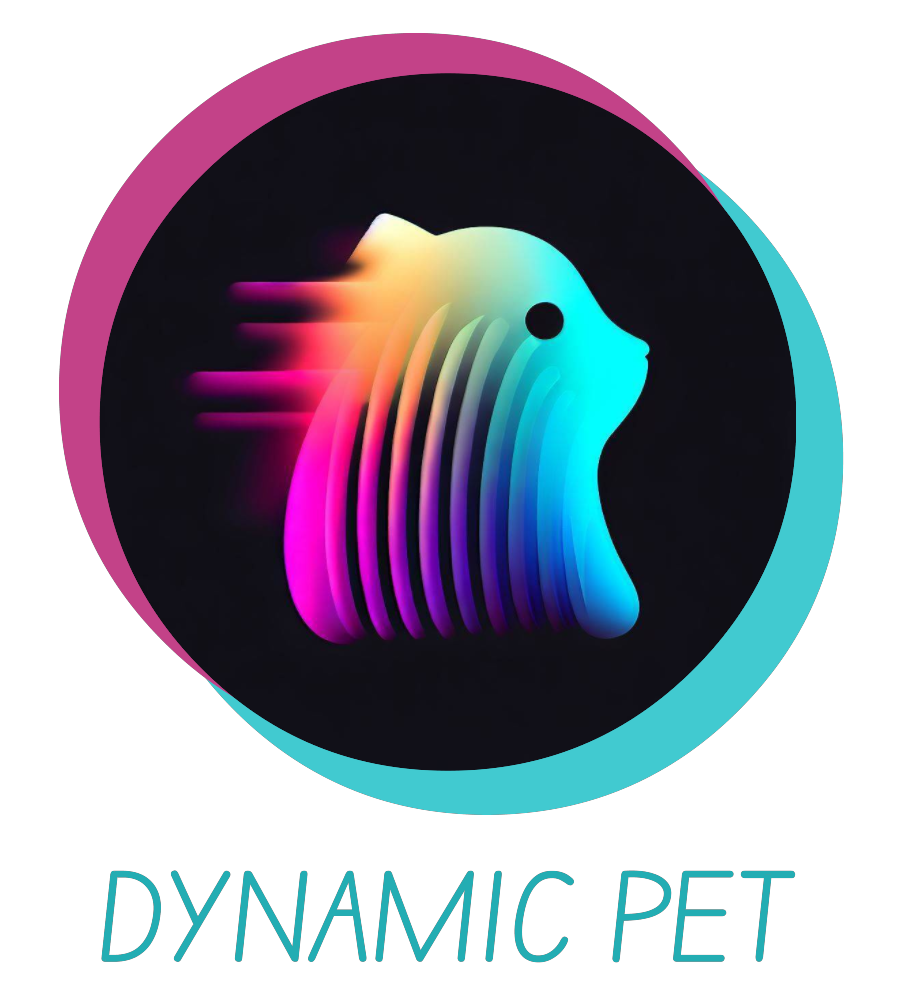

# Dynamic PET 

<!-- [][pypi_]
[][status]
[][python version]
[][license]
-->

[][read the docs]
[][tests]
[][codecov]

[][pre-commit]
[][black]

<!--
[pypi_]: https://pypi.org/project/dynamicpet/
[status]: https://pypi.org/project/dynamicpet/
[python version]: https://pypi.org/project/dynamicpet
-->

[read the docs]: https://bilgelm.github.io/dynamicpet
[tests]: https://github.com/bilgelm/dynamicpet/actions?workflow=Tests
[codecov]: https://app.codecov.io/gh/bilgelm/dynamicpet
[pre-commit]: https://github.com/pre-commit/pre-commit
[black]: https://github.com/psf/black

_Dynamic PET_ is designed for voxelwise analysis of reconstructed dynamic
positron emission tomography (PET) scans, and also supports regional analysis.

_Dynamic PET_ provides a command line interface (CLI) for easy image processing and also a Python API with greater flexibility.

Methods implemented in the CLI include:

- Denoising
  - HighlY constrained backPRojection method constraining the backprojections to Local Regions of interest ([HYPR-LR])
- Reference tissue-based modeling
  - Standardized Uptake Value Ratio (SUVR)
  - Logan Reference Tissue Model ([LRTM])
  - Simplified Reference Tissue Model (SRTM)

Several implementations of estimating SRTM parameters are available:

- Nonlinear optimization, as described by [Lammertsma and Hume, Neuroimage (1996)](https://doi.org/10.1006/nimg.1996.0066)
- Two-step SRTM (SRTM2), as described by [Wu and Carson, J Cereb Blood Flow Metab (2002)](https://doi.org/10.1097/01.WCB.0000033967.83623.34)
- Linear Regression with Spatial Constraint (LRSC), as described by [Zhou et al., Neuroimage (2003)](<https://doi.org/10.1016/S1053-8119(03)00017-X>)

[lrtm]: https://doi.org/10.1097/00004647-199609000-00008
[hypr-lr]: https://doi.org/10.2967/jnumed.109.073999

## Requirements

_Dynamic PET_ requires Python 3.11+ and the following modules:
`numpy` and `scipy` for vector and matrix operations,
`nibabel` for neuroimaging data I/O and simple manipulations, and
`click` for the CLI.

## Installation

You can install _Dynamic PET_ via [pip] after cloning the repository:

```console
$ git clone https://github.com/bilgelm/dynamicpet.git
$ pip install -e dynamicpet
```

## Usage

Please see the [Usage] for details on the CLI.

## Example

CLI usage is illustrated below on a dynamic PET dataset available on [OpenNeuro].

First, download the [NRM2018 PET Grand Challenge Dataset](https://openneuro.org/datasets/ds001705/versions/1.0.1/download).
You will then need to create a binary mask that is in the same space as the PET image that defines the reference region. The full path to this binary mask will be referred to as `REFMASK`. Generally, the reference region is defined on a structural MRI and then mapped onto the PET via image registration and transformation.

After installing _Dynamic PET_ as described above, execute:

```console
$ kineticmodel PET --model SRTMZhou2003 --refmask <REFMASK> --outputdir <OUTPUTDIR> --fwhm 5
```

where

```console
$ PET=<OPENNEURODATA>/ds001705-download/sub-000101/ses-baseline/pet/sub-000101_ses-baseline_pet.nii
```

Before running these commands, replace
`<OPENNEURODATA>` with the path to the directory where you downloaded the data from OpenNeuro and
`<OUTPUTDIR>` with path to the directory where you'd like to save the parametric images.

> [!WARNING]
> Aside from `SUVR` and `SRTMZhou2003`, the remaining kinetic model
> implementations are very time consuming and are not recommended for imaging data.

[openneuro]: https://openneuro.org

## Future

Future plans for expanding the scope of _Dynamic PET_ include:

- more kinetic models and implementations
- support for surface (i.e., vertex-wise) analysis
- parallel processing

## Contributing

Contributions are very welcome.
To learn more, see the [Contributor Guide].

## License

Distributed under the terms of the [MIT license][license],
_Dynamic PET_ is free and open source software.

## Issues

If you encounter any problems,
please [file an issue] along with a detailed description.

## Credits

This project was generated from [@cjolowicz]'s [Hypermodern Python Cookiecutter] template.

[@cjolowicz]: https://github.com/cjolowicz
[pypi]: https://pypi.org/
[hypermodern python cookiecutter]: https://github.com/cjolowicz/cookiecutter-hypermodern-python
[file an issue]: https://github.com/bilgelm/dynamicpet/issues
[pip]: https://pip.pypa.io/

<!-- github-only -->

[license]: https://github.com/bilgelm/dynamicpet/blob/main/LICENSE
[contributor guide]: https://github.com/bilgelm/dynamicpet/blob/main/CONTRIBUTING.md
[usage]: https://dynamicpet.readthedocs.io/en/latest/usage.html
